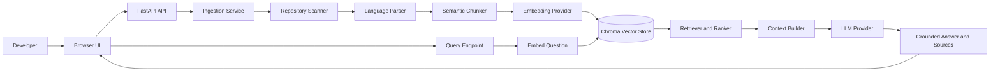
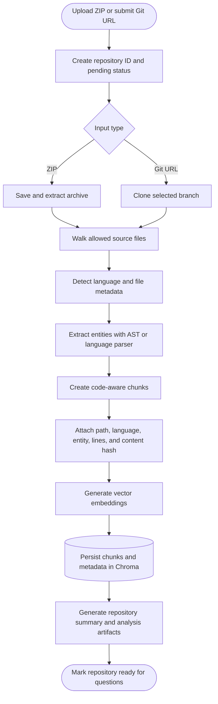
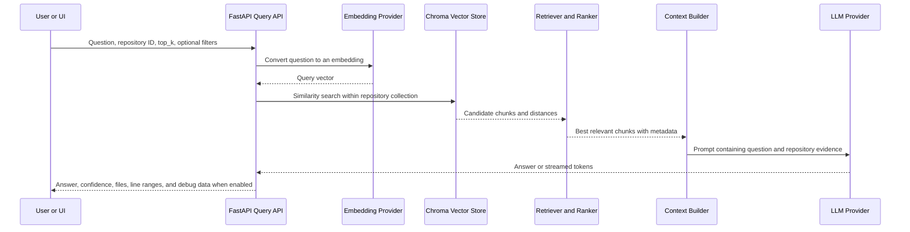
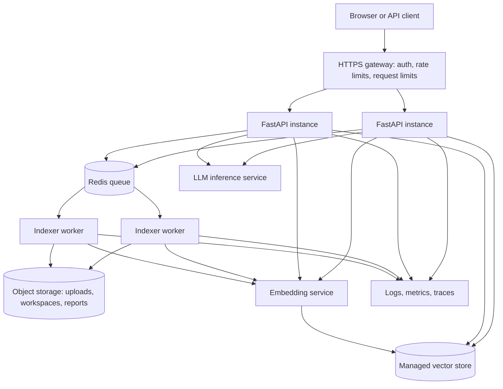

#AI_Repository_Analysis_Platform

A local-first Retrieval-Augmented Generation (RAG) application for understanding software repositories. Upload a ZIP archive or clone a Git repository, then ask grounded questions about its code. The platform indexes code into semantic chunks, retrieves relevant material, and asks a configurable LLM to answer with source references.

This is the canonical project. `RAG_SHOWSTOPPER-main` was evaluated as an earlier, smaller snapshot; it has no unique production capability and is not maintained as a branch.

## What It Can Do

- Ingest a ZIP archive or clone an HTTPS Git repository.
- Scan source files and recognize Python, JavaScript/TypeScript, Java, and .NET code.
- Extract code structure, create chunks and metadata, and persist embeddings in ChromaDB.
- Answer repository questions through standard and streaming RAG endpoints with retrieved-file citations.
- Generate architecture, security, dependency, licensing, engineering-quality, modernization, and submission-oriented analysis.
- Provide a browser UI plus FastAPI/OpenAPI endpoints.
- Run locally with Ollama, or switch LLM, embedding, and vector-store providers through environment variables.

## How RAG Works Here



The system has two separate but connected workflows. Indexing converts a repository into searchable evidence. Querying uses that evidence to make an answer grounded in repository files instead of only relying on the LLM's general knowledge.

### Indexing workflow



The repository ID isolates each indexed repository. A chunk is not just raw text: it carries metadata such as its relative file path, language, chunk type, and start/end line numbers. That metadata lets the UI show citations, lets filters narrow a query, and gives the model enough context to explain where an answer came from. The content hash supports future deduplication and incremental indexing work.

### Query workflow



`top_k` controls how many candidate chunks are supplied as evidence. Larger values can improve coverage but may add irrelevant context, increase latency, and make an answer less focused. The confidence score is a retrieval-distance heuristic, not a guarantee that the generated statement is true; source paths and line ranges should be checked for important decisions.

The provider layer keeps the pipeline independent of a specific model service:

| Concern | Default local option | Other implemented option |
| --- | --- | --- |
| LLM | Ollama | OpenRouter, Hugging Face, OpenAI-compatible endpoint |
| Embeddings | `BAAI/bge-small-en-v1.5` locally | Hugging Face Inference API |
| Vector store | Persistent local Chroma | Chroma Cloud |

### Component responsibilities

| Component | Responsibility | Why it matters |
| --- | --- | --- |
| FastAPI endpoints | Validate requests, report status, expose queries and reports | Keeps the UI and integrations on a stable HTTP contract |
| Ingestion and scanner | Acquire repositories and select files to analyze | Defines the security and cost boundary of indexing |
| Parsers and chunker | Identify code structures and split them into useful evidence | Better chunk boundaries generally produce better retrieval |
| Metadata builder | Records file, language, entity, lines, and hash | Enables citations, filtering, debugging, and incremental work |
| Embedding provider | Turns chunks and questions into comparable vectors | Determines semantic similarity quality and latency |
| Vector-store provider | Persists vectors and finds nearest chunks | Provides retrieval speed and repository isolation |
| Retriever and ranker | Selects the most useful evidence for a question | Prevents the LLM from receiving a whole repository indiscriminately |
| Context builder | Formats evidence into a bounded, explicit prompt | Makes answers traceable and controls prompt size |
| LLM provider | Generates the final natural-language answer | Can be switched without rewriting the RAG pipeline |

## Project Layout

```text
backend/
  app/api/v1/             FastAPI endpoints
  app/services/           ingestion, parsing, retrieval, reports, providers
  app/services/providers/ pluggable LLM, embedding, and vector-store adapters
  app/workers/            Celery task definitions
frontend/                 browser UI (vanilla HTML, CSS, JavaScript)
data/                     local runtime data; never commit this directory
docker-compose.yml        backend, Chroma, Ollama, Redis, and worker services
.env.example              safe configuration template
```

## Download and Run Locally

### Prerequisites

- Git
- Python 3.10 or newer
- [Ollama](https://ollama.com/) for the default local LLM workflow
- Docker Desktop only if using the container workflow

### 1. Clone and configure

```powershell
git clone https://github.com/YOUR-ACCOUNT/YOUR-REPOSITORY.git
cd YOUR-REPOSITORY
Copy-Item .env.example .env
```

Do not commit `.env`. It can contain API keys. The local defaults in `.env.example` require no cloud credentials.

### 2. Install backend dependencies

```powershell
cd backend
python -m venv .venv
.venv\Scripts\Activate.ps1
pip install -r requirements.txt
```

### 3. Start Ollama and download the configured model

In a separate terminal:

```powershell
ollama serve
ollama pull qwen3.5:4b
```

If you use another Ollama model, set the identical model name in `OLLAMA_MODEL` inside `.env` before starting the API.

### 4. Start the application

From `backend/`:

```powershell
uvicorn app.main:app --reload --host 0.0.0.0 --port 8000
```

Open [http://localhost:8000](http://localhost:8000). Interactive API documentation is at [http://localhost:8000/docs](http://localhost:8000/docs).

### Container workflow

From the repository root:

```powershell
docker compose up --build -d
docker compose exec ollama-service ollama pull llama3
```

The Docker stack overrides the model to `llama3`. Its services are exposed at backend `http://localhost:8000`, Chroma `http://localhost:8001`, Ollama `http://localhost:11434`, and Redis `http://localhost:6379`.

## Using the Application

1. Open the browser UI.
2. Upload a repository ZIP or submit an HTTPS Git URL.
3. Wait for indexing to complete; the application reports progress.
4. Select the indexed repository and ask a specific question, such as `Where is authentication implemented?` or `Which modules depend on the repository scanner?`.
5. Review the returned answer together with file paths, line ranges, and confidence information.

The API also supports these main endpoints:

| Method | Endpoint | Purpose |
| --- | --- | --- |
| `GET` | `/api/v1/health` | Service health and active local configuration |
| `POST` | `/api/v1/repositories/upload` | Upload a ZIP repository |
| `POST` | `/api/v1/repositories/clone` | Clone and index a Git repository |
| `GET` | `/api/v1/repositories` | List indexed repositories |
| `GET` | `/api/v1/repositories/{id}/status` | Check indexing progress |
| `POST` | `/api/v1/query` | Ask a repository question |
| `POST` | `/api/v1/query/stream` | Stream an answer as server-sent events |
| `GET` | `/api/v1/reports/{id}/analysis` | Read generated analysis |
| `GET` | `/api/v1/reports/{id}/export` | Download analysis output |

## Provider Configuration

All provider selection is environment-driven, so switching an integration does not require edits to application code.

```env
LLM_PROVIDER=ollama
VECTOR_PROVIDER=local_chroma
EMBEDDING_PROVIDER=local_bge
OLLAMA_HOST=http://localhost:11434
OLLAMA_MODEL=qwen3.5:4b
```

For a hosted LLM, set `LLM_PROVIDER=openrouter` and provide `OPENROUTER_API_KEY`. For a compatible gateway such as vLLM, set `LLM_PROVIDER=inline_model`, `INLINE_MODEL_BASE_URL`, `INLINE_MODEL_NAME`, and its key. Chroma Cloud requires `VECTOR_PROVIDER=cloud_chroma` and the `CHROMA_*` values. Keep credentials only in `.env` or a deployment secret manager.

## Scaling the System

The local setup is intended for learning and individual repository analysis. For larger workloads, make these changes incrementally:



The important design boundary is that query APIs should remain responsive while repository ingestion runs asynchronously. Workers can be scaled for long-running cloning, parsing, and embedding tasks, while API instances scale for interactive queries. Object storage avoids losing repositories when a container restarts, and observability provides the data needed to tune chunk size, model selection, worker concurrency, and retrieval quality.

1. Run the API and Celery worker as separate containers or deployments; increase worker concurrency only after measuring CPU, RAM, model, and vector-store pressure.
2. Move local Chroma storage to Chroma Cloud or another managed vector-store deployment and partition collections by tenant and repository.
3. Store uploads, extracted repositories, and generated reports in object storage instead of the local `data/` directory.
4. Use Redis as the queue and result backend, add retry/dead-letter policies, and expose queue and indexing metrics.
5. Put authentication, request limits, repository-size limits, and Git URL allowlists in front of public deployments.
6. Run embedding and LLM inference as independently scalable services. Batch embeddings, cache repeated chunks by content hash, and use smaller models for routine queries.
7. Add automated integration tests with an isolated vector collection before treating the service as multi-user production infrastructure.

## What You Can Learn From This Codebase

- A complete RAG lifecycle: ingest, parse, chunk, embed, retrieve, construct context, generate, and evaluate.
- Why code-aware chunks and metadata improve on naive fixed-size text splitting.
- How retrieval quality is affected by embedding models, ranking, filters, context size, and source attribution.
- Provider abstraction: exchange a local model for cloud inference without changing the core pipeline.
- Practical backend engineering with FastAPI, Pydantic settings, background work, persistence, API contracts, and containerization.
- The operational side of LLM apps: secrets, costs, latency, queueing, evaluation, safety controls, and observability.

A useful learning sequence is: run the local defaults, index a small known repository, inspect retrieved sources for several questions, change `top_k` and the embedding model, then compare quality and latency. Only then add hosted providers or distributed workers.

## Repository Comparison

| Area | `RAG` (keep) | `RAG_SHOWSTOPPER-main` (do not branch) |
| --- | --- | --- |
| Source scope | Full provider layer, retrieval/ranking, dashboard and report analyzers, database models, workers | Earlier baseline pipeline and UI |
| Provider support | Local plus cloud/compatible options | Local Ollama and local embeddings only |
| Git readiness | Existing Git history and ignored runtime directories | No Git repository |
| Documentation | One maintained README | Nine planning/specification files but a nearly empty README |
| Unique capability | Yes, including newer analysis and provider features | No capability absent from `RAG` |

Keeping the showstopper copy as a Git branch would make history harder to maintain without showing a distinct approach. If it is wanted for personal archival purposes, keep it outside the GitHub repository; otherwise it can be removed after confirming that no local notes are needed.

## GitHub Publishing Checklist

1. Rotate every key that has ever been placed in the tracked `.env` file. Removing it now does not remove it from earlier Git commits.
2. Confirm `git status` does not show `data/`, `logs/`, `.venv/`, or `.env` as staged for commit.
3. Review the diff, then commit the cleanup:

```powershell
git add .gitignore .env.example README.md backend/app/core/config.py
git add -u
git status
git commit -m "docs: prepare repository for GitHub"
```

4. Create an empty GitHub repository, then add its remote and push:

```powershell
git remote add origin https://github.com/YOUR-ACCOUNT/YOUR-REPOSITORY.git
git push -u origin main
```

Before a public push, rewrite local history or start a clean repository if `.env` ever held real secrets. Secret rotation is mandatory either way.

## Current Verification and Limits

The backend modules compile successfully and the FastAPI application imports with all documented routes registered. Full end-to-end indexing and answer quality still depend on running Ollama, model availability, and a live vector store; the repository currently uses standalone verification scripts rather than a consolidated automated test suite.
